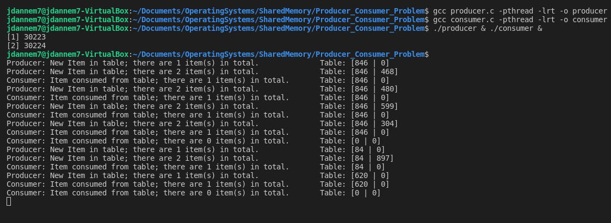

# The Producer-Consumer Problem
### CS33211: Operating Systems
This project is an implementation of the Producer-Consumer Problem using shared memory and semaphores.

## The Producer-Consumer Problem
In Computer Science, concurrency, or the ability to run parts of a program or procedure at the same time, is a much desired feature due to the significantly increased computation speeds it often brings with it. It is, however, not without its limitations. Problems can arise when two or more processes, threads, etc., read and write from the same memory locations because the operations of the concurrent processes are not always atomic and operations on the memory space may not occur in the intended sequence. Such cases often require the use of synchronization primitives like semaphores or mutex locks to constrain the order of operations. The Producer-Consumer Problem is a classic example of such synchronization that consists of two processes, the producer and the consumer which share
a fixed buffer of memory with one another. The producer's operation is to sequentially produce units of data and store them on this fixed buffer. Meanwhile, the consumer must also consume and remove these data elements from the buffer in a sequential fashion. The goal of this problem is twofold. First to ensure that the producer doesn't attempt to put data into an already full buffer and the consumer doesn't remove data from an empty one. Second is to synchronize the processes in a way that ensures that neither process can manipulate the buffer while it is being accessed by the other.

### Prerequisites
This project was tested with a system consisting of a gcc compiler, gdb debugger, and Ubuntu 20.04.3 LTS

### Installation
1. Clone the Repository

git clone https://github.com/jdannem6/Porducer-Consumer_Problem.git

2. Compile the two programs: consumer.c and producer.c

3. Run the output files together as follows
4. Terminate the program with Ctrl + c

## Example Output

